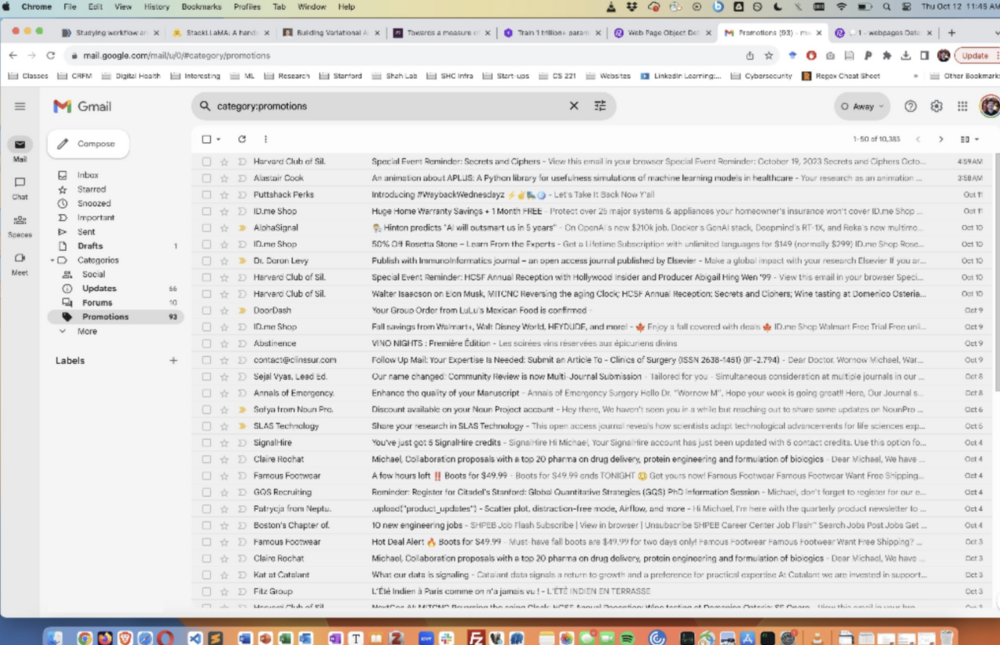
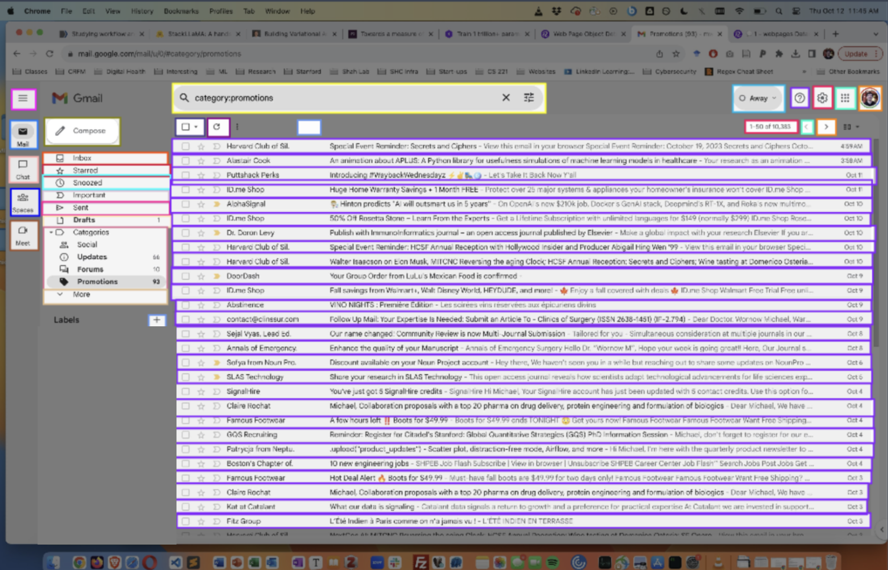

# Dataset for Dashboard Segmentation

Goal: Train a vision model to automatically segment a dashboard into its semantic components.

<p float="left">
    
     
</p>


## How to Run

Load the Chrome Extension located in the `chrome_extension/` folder. This will allow you to annotate webpages and save the annotations to a JSON file.

```bash
1. Open Chrome
2. Go to chrome://extensions
3. Enable Developer Mode
4. Click "Load Unpacked"
5. Select the chrome_extension/ folder
```

After you generate a bunch of images/annotations, upload them to RoboFlow using the `upload.py` script:

```bash
python3 upload.py --path_to_folder /path/to/folder/with/images_and_annotations
```

Your data should now be visible here: [https://app.roboflow.com/workflowaugmentation/webpages-abgy4/](https://app.roboflow.com/workflowaugmentation/webpages-abgy4/)

## Roboflow

Login to our Roboflow account using these credentials:

```
Email: eclairagent9@gmail.com
Password: eclairagent123
```

Choose the **workflowaugmentation** project.

## Steps

Assemble dataset
[X] Develop tool to automatically segment and annotate HTML webpages => This is `chrome_extension/`
[X] Upload dataset to RoboFlow => This is `upload.py`

Train model
1. Train segmentation model on webpage dataset